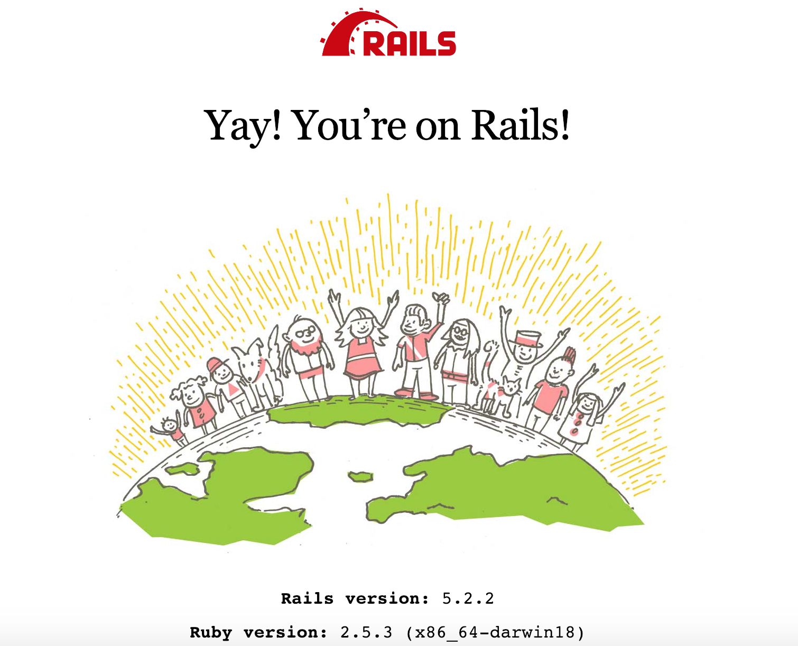

# CVWO Assignment

Name: Chen Yuan Bo

Matric No.: A0183156A

Website url: https://rocky-garden-74977.herokuapp.com/

Final write-up is in the root directory called cvwo_final_assignment.pdf

### Rails Start Up Screen

This README would normally document whatever steps are necessary to get the
application up and running.

Things you may want to cover:

* Ruby version

* System dependencies

* Configuration

* Database creation

* Database initialization

* How to run the test suite

* Services (job queues, cache servers, search engines, etc.)

* Deployment instructions

* ...
